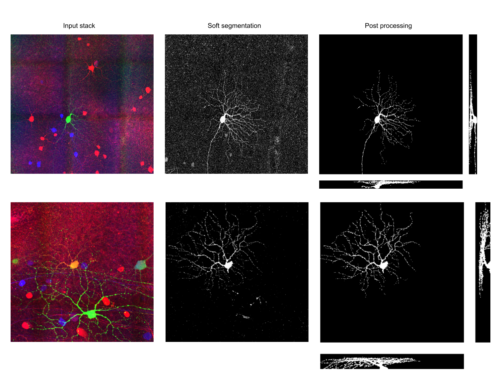

## Soft Segmentation of Viral Labeled Neurons

The script designed to segment spectral (pseudo-color) viral labeled dendritic trees. It avoids hard borders and creats soft segments for each distinct pseudo-color. The package contains automatic palette computation and post processing scripts to obtain denopised binary masks from soft segments. We also developed a image flatteinmg algorthm based on weighted L1-norm TV, and implemete it using Prox-TV package. Additionaly, we also recommend using BaSIC ImageJ background subruction plugin (freely avaliable, also included here) if image are corrupted by heavy background noise. As an example (recovery of green and orange neuron):

   

### Install dependencies

Anaconda environemnts are recommended. After installing it, create a enivronment wtih Python 2.7
    
    conda create -n softsegment python=2.7

Then istall following dependecies: Scipy, scikit-image, cvxopt, cython, cffi, pathlib and enum34 by:

    conda install -c anaconda -n softsegment <package_name>
    
Then install Prox-tv library by:

    pip install prox-tv

### How to use

### Acknowledgements

Our implementation is adapted from the paper "Decomposing Images into Layers via RGB-space Geometry" by Tan et. al. (2015), please check their amazing work here: https://github.com/CraGL/Decompose-Single-Image-Into-Layers

We use Prox-Tv library for weighted L1-norm image flatttening: https://github.com/albarji/proxTV 

We use ImgeJ plugin of BaSIC background subtruction: https://github.com/QSCD/BaSiC

### Referances

